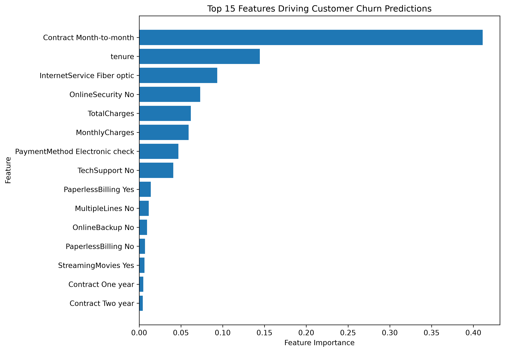

# 📊 Customer Churn Analytics & Machine Learning

An end-to-end customer churn analytics and machine learning project using **Python, Pandas, Scikit-learn, Statistical Analysis, and Business Intelligence techniques** to identify customers at risk of churn and translate predictive insights into actionable retention strategies.

The project covers the complete analytical workflow — from **data cleaning and exploratory analysis to model development, cross-validation, hyperparameter tuning, classification threshold optimization, model interpretation, and customer risk segmentation**.

## 🎯 Project Highlights

- Analyzed **7,043 telecom customers** to identify key churn patterns.
- Compared **Logistic Regression, Decision Tree, Random Forest, and Gradient Boosting** classifiers.
- Tuned Gradient Boosting using **Stratified 5-Fold Cross-Validation**.
- Achieved a final **ROC-AUC of 84.73%**.
- Optimized the classification threshold from **0.50 to 0.30** to prioritize churn detection.
- Achieved **76.20% Recall**, identifying **285 of 374 actual churners** in the held-out test set.
- Reduced missed churners (False Negatives) from **181 to 89** compared with baseline Gradient Boosting.
- Segmented customers into **Low, Moderate, High, and Very High churn-risk groups**.
- Identified **76.2% of actual churners within approximately 37.3% of customers**, enabling more focused retention targeting.

## 💼 Business Problem

Customer churn directly affects recurring revenue, customer lifetime value, and acquisition costs. Identifying customers who are likely to leave allows businesses to intervene before churn occurs and allocate retention resources more effectively.

The objective of this project is not only to predict customer churn, but also to understand **which customer characteristics are associated with churn, identify high-risk customer segments, and translate model predictions into actionable retention strategies**.

## 🎯 Project Objectives

- Analyze customer demographics, account characteristics, services, contracts, and payment behavior to identify churn patterns.
- Build and compare multiple machine learning classification models.
- Evaluate models using **Accuracy, Precision, Recall, F1-Score, and ROC-AUC** rather than relying on accuracy alone.
- Use cross-validation and hyperparameter tuning to improve model reliability.
- Optimize the classification threshold to prioritize identification of actual churners.
- Interpret the final model to identify important predictive churn drivers.
- Segment customers into actionable churn-risk groups based on predicted probabilities.
- Develop data-driven recommendations for targeted customer retention.

## 📊 Dataset Overview

The project uses the **Telco Customer Churn** dataset, containing customer-level information covering demographics, subscribed services, account tenure, contract type, billing preferences, charges, and churn status.

### Dataset Summary

| Metric | Value |
|---|---:|
| Total Customers | 7,043 |
| Original Features | 20 |
| Target Variable | Churn |
| Non-Churn Customers | 5,174 (73.46%) |
| Churned Customers | 1,869 (26.54%) |
| Training Set | 5,634 customers |
| Test Set | 1,409 customers |
| Processed ML Features | 45 |

### Feature Categories

**Customer Profile**
- Gender
- Senior Citizen
- Partner
- Dependents

**Account Information**
- Tenure
- Contract
- Paperless Billing
- Payment Method
- Monthly Charges
- Total Charges

**Services**
- Phone Service
- Multiple Lines
- Internet Service
- Online Security
- Online Backup
- Device Protection
- Tech Support
- Streaming TV
- Streaming Movies

**Target**

`Churn` indicates whether the customer discontinued the service:

- `0` — No Churn
- `1` — Churn

The target distribution is moderately imbalanced, with approximately **26.54% of customers having churned**. This makes metrics such as **Recall, F1-Score, and ROC-AUC** particularly important when evaluating model performance.

## 🔄 Project Workflow

The project follows a structured end-to-end analytics and machine learning workflow:

```text
Business Problem
        │
        ▼
Data Collection
        │
        ▼
Data Cleaning & Preparation
        │
        ▼
Exploratory Data Analysis
        │
        ▼
Feature Engineering
        │
        ▼
Train/Test Split
        │
        ▼
Model Training
        │
        ▼
Model Evaluation
        │
        ▼
Cross-Validation & Hyperparameter Tuning
        │
        ▼
Classification Threshold Optimization
        │
        ▼
Model Interpretation
        │
        ▼
Customer Churn Risk Segmentation
        │
        ▼
Business Insights & Retention Recommendations
```

### Modeling Approach

Categorical variables were transformed using **One-Hot Encoding**, while numerical variables were prepared through the preprocessing pipeline.

The dataset was split into training and held-out test sets using **stratification** to preserve the original churn distribution.

Four classification algorithms were evaluated:

1. Logistic Regression
2. Decision Tree
3. Random Forest
4. Gradient Boosting

Model development then progressed through **cross-validation, hyperparameter tuning, classification threshold optimization, final model evaluation, and model interpretation**.

## 🔍 Exploratory Data Analysis

Exploratory Data Analysis was performed to understand customer behavior, identify churn patterns, and guide subsequent machine learning development.

Several customer characteristics showed substantial differences in observed churn behavior.

### Key Churn Insights

| Customer Characteristic | Key Finding |
|---|---|
| Contract Type | Month-to-month customers showed **42.71% churn**, compared with only **2.83%** for two-year contracts |
| Tenure | Churned customers averaged **17.98 months**, compared with **37.57 months** for non-churners |
| Internet Service | Fiber Optic customers showed **41.89% churn**, compared with **18.96%** for DSL |
| Online Security | Customers without Online Security showed **41.77% churn**, compared with **14.61%** among customers with the service |
| Tech Support | Customers without Tech Support showed **41.64% churn**, compared with **15.17%** among customers with support |
| Payment Method | Electronic Check customers showed approximately **45.29% churn** |
| Monthly Charges | Churned customers averaged **74.44**, compared with **61.27** among non-churners |
| Early Tenure | Customers with 0–12 months tenure showed approximately **47.44% churn** |

### EDA Takeaway

The exploratory analysis indicates that churn is particularly concentrated among customers with:

- Month-to-month contracts
- Shorter customer tenure
- Fiber Optic internet service
- No Online Security
- No Tech Support
- Electronic Check payments
- Higher monthly charges

These relationships represent **observed associations rather than causal effects**, but they provide important signals for predictive modeling and customer retention analysis.

## 🤖 Machine Learning Model Development

Four classification algorithms were trained and evaluated using the same held-out test dataset:

- Logistic Regression
- Decision Tree Classifier
- Random Forest Classifier
- Gradient Boosting Classifier

Because the objective is to identify customers at risk of churn, model evaluation considered **Precision, Recall, F1-Score, and ROC-AUC** alongside Accuracy.

### Baseline Model Comparison

| Model | Accuracy | Precision | Recall | F1-Score | ROC-AUC |
|---|---:|---:|---:|---:|---:|
| Logistic Regression | **80.34%** | 65.20% | **55.61%** | **60.03%** | 84.28% |
| Decision Tree | 72.25% | 47.81% | 49.73% | 48.75% | 65.04% |
| Random Forest | 78.85% | 63.01% | 49.20% | 55.26% | 81.66% |
| Gradient Boosting | 80.27% | **66.55%** | 51.60% | 58.13% | **84.33%** |

### Baseline Evaluation

Logistic Regression and Gradient Boosting emerged as the strongest baseline candidates.

**Logistic Regression** achieved the highest baseline Recall and F1-Score, while **Gradient Boosting** achieved the highest baseline ROC-AUC and Precision.

The relatively close performance of these two models motivated further validation and optimization rather than selecting a final model based on Accuracy alone.

## ⚙️ Cross-Validation & Hyperparameter Tuning

To improve model reliability and reduce dependence on a single train-validation split, **Stratified 5-Fold Cross-Validation** was used during model optimization.

Stratification ensured that each fold maintained approximately the same churn distribution as the overall training dataset.

### Gradient Boosting Hyperparameter Tuning

Gradient Boosting was optimized using `GridSearchCV` with **ROC-AUC** as the scoring metric.

The search evaluated:

- **54 hyperparameter combinations**
- **5 cross-validation folds**
- **270 total model fits**

### Best Hyperparameters

| Hyperparameter | Selected Value |
|---|---:|
| `learning_rate` | 0.1 |
| `max_depth` | 3 |
| `min_samples_leaf` | 10 |
| `n_estimators` | 50 |

**Best Cross-Validation ROC-AUC: 85.01%**

The tuned Gradient Boosting model achieved a held-out test ROC-AUC of **84.73%**, indicating that its strong cross-validation performance generalized well to unseen test data.

### Tuned Gradient Boosting Performance

| Metric | Score |
|---|---:|
| Accuracy | 80.48% |
| Precision | 67.49% |
| Recall | 51.07% |
| F1-Score | 58.14% |
| ROC-AUC | **84.73%** |

Although tuning improved ROC-AUC and Precision, Recall remained relatively low at the default **0.50 classification threshold**.

Because missing actual churners represents an important business risk, the next stage focused on **classification threshold optimization** rather than further increasing model complexity.

## 🎯 Classification Threshold Optimization

Classification models typically use a default probability threshold of **0.50** to convert predicted probabilities into class predictions.

For customer churn, however, missing a customer who is genuinely at risk of leaving can be more costly than contacting some customers who ultimately remain.

Therefore, classification thresholds were evaluated using **out-of-fold probabilities generated through Stratified 5-Fold Cross-Validation on the training data**.

This ensured that the threshold was selected without optimizing directly on the held-out test dataset.

### Selected Threshold

A classification threshold of **0.30** was selected for the final Tuned Gradient Boosting model.

At this threshold, cross-validated training performance achieved:

| Metric | CV Performance |
|---|---:|
| Precision | 55.12% |
| Recall | **76.72%** |
| F1-Score | **64.15%** |

The 0.30 threshold produced the highest F1-Score among the evaluated thresholds while substantially increasing churn Recall.

### Final Test Performance

After locking the threshold at **0.30**, the final model was evaluated on the held-out test dataset:

| Metric | Default Threshold 0.50 | Final Threshold 0.30 |
|---|---:|---:|
| Accuracy | **80.48%** | 76.58% |
| Precision | **67.49%** | 54.18% |
| Recall | 51.07% | **76.20%** |
| F1-Score | 58.14% | **63.33%** |
| ROC-AUC | 84.73% | **84.73%** |

Lowering the threshold represents a deliberate business trade-off: Accuracy and Precision decrease, while the model identifies a substantially larger proportion of actual churners.

### Business Impact of Threshold Optimization

At the default threshold, the tuned Gradient Boosting model identified:

- **193 True Positives**
- **181 False Negatives**

At the optimized 0.30 threshold, the final model identified:

- **285 True Positives**
- **89 False Negatives**

This means the final operating strategy identifies **92 additional churners** and reduces missed churners from **181 to 89**.

The final model therefore prioritizes **churn detection and retention opportunity** rather than maximizing Accuracy alone.

## 🔎 Model Interpretation & Key Churn Drivers

After selecting the final Tuned Gradient Boosting model, feature importance was analyzed to understand which variables contributed most strongly to churn predictions.

### Top Predictive Features

| Rank | Feature | Importance |
|---:|---|---:|
| 1 | Month-to-Month Contract | **41.12%** |
| 2 | Tenure | **14.45%** |
| 3 | Fiber Optic Internet | **9.34%** |
| 4 | No Online Security | **7.31%** |
| 5 | Total Charges | **6.18%** |
| 6 | Monthly Charges | **5.93%** |
| 7 | Electronic Check | **4.69%** |
| 8 | No Tech Support | **4.08%** |

### Feature Importance Visualization


Month-to-month contract status was by far the most influential feature in the final Gradient Boosting model.

### Connecting Model Interpretation with EDA

Several of the model's most important predictors were also associated with substantial differences in observed churn during exploratory analysis:

| Predictive Factor | Observed Churn Pattern |
|---|---|
| Month-to-Month Contract | **42.71% churn** vs **2.83%** for two-year contracts |
| Tenure | Churners averaged **17.98 months** vs **37.57 months** for non-churners |
| Fiber Optic | **41.89% churn** vs **18.96%** for DSL |
| No Online Security | **41.77% churn** vs **14.61%** with Online Security |
| Monthly Charges | Churners averaged **74.44** vs **61.27** for non-churners |
| Electronic Check | Approximately **45.29% churn** |
| No Tech Support | **41.64% churn** vs **15.17%** with Tech Support |

The consistency between exploratory analysis and model interpretation indicates that **contract structure, customer tenure, service configuration, pricing, payment behavior, and support services** are important predictive indicators of churn.

> **Note:** Feature importance measures predictive contribution, not causality. These relationships should therefore be interpreted as predictive associations rather than evidence that a particular feature directly causes customer churn.

## 📈 Customer Churn Risk Segmentation

The final model's predicted probabilities were converted into four operational risk segments to help prioritize retention activity.

| Risk Segment | Customers | Actual Churners | Avg. Predicted Risk | Actual Churn Rate |
|---|---:|---:|---:|---:|
| Low Risk | 754 | 60 | 7.76% | **7.96%** |
| Moderate Risk | 129 | 29 | 25.02% | **22.48%** |
| High Risk | 349 | 154 | 44.56% | **44.13%** |
| Very High Risk | 177 | 131 | 72.47% | **74.01%** |

### Churn Rate by Predicted Risk Segment



Observed churn increases consistently across the risk segments, from only **7.96% among Low Risk customers to 74.01% among Very High Risk customers**.

### 🎯 Retention Targeting Opportunity

The **High + Very High Risk** groups contain:

- **526 of 1,409 customers (37.3%)**
- **285 of 374 actual churners (76.2%)**

> **By targeting approximately 37% of customers, the model identifies approximately 76% of actual churners.**

This enables retention teams to focus resources on a substantially smaller, higher-risk portion of the customer base rather than applying the same intervention strategy to every customer.

## 💡 Business Recommendations

Based on the combined EDA, machine learning, feature importance, and risk segmentation results:

1. **Prioritize High-Risk Customers**  
   Focus retention resources on High and Very High Risk customers identified by the model.

2. **Target Month-to-Month Customers**  
   Encourage high-risk month-to-month customers to consider longer-term contracts through appropriate loyalty benefits or service bundles.

3. **Strengthen Early-Tenure Engagement**  
   Introduce proactive onboarding and retention initiatives for newer customers, as churners showed substantially shorter average tenure.

4. **Investigate Fiber Optic Experience**  
   Review pricing, reliability, service quality, and customer experience within the Fiber Optic segment, which showed elevated observed churn.

5. **Review Pricing and Service Value**  
   Identify high-charge customers with elevated churn probability and evaluate whether pricing, bundles, or loyalty incentives could improve perceived value.

6. **Promote Support & Security Services**  
   Evaluate targeted offers for Online Security and Tech Support, particularly among high-risk customers currently without these services.

7. **Investigate Electronic Check Customers**  
   Examine whether billing experience, payment friction, or customer characteristics explain the elevated churn observed among Electronic Check users.

### Retention Strategy

A tiered intervention strategy could be applied:

| Risk Level | Suggested Approach |
|---|---|
| Very High Risk | Priority personalized retention intervention |
| High Risk | Targeted retention campaigns and service offers |
| Moderate Risk | Lower-cost email/SMS engagement |
| Low Risk | Standard customer engagement |

These recommendations should be validated through controlled retention experiments before interpreting the observed relationships as causal effects.

## 📁 Project Structure

```text
Customer-Churn-Analytics-ML/
│
├── data/
│   ├── raw/
│   │   └── WA_Fn-UseC_-Telco-Customer-Churn.csv
│   └── processed/
│       └── telco_customer_churn_clean.csv
│
├── notebooks/
│   ├── 01_Data_Understanding.ipynb
│   ├── 02_Data_Cleaning.ipynb
│   ├── 03_Exploratory_Data_Analysis.ipynb
│   └── 04_Machine_Learning.ipynb
│
├── .gitignore
├── README.md
└── requirements.txt
```

The project is organized as a sequential analytical workflow, with separate notebooks for data understanding, cleaning, exploratory analysis, and machine learning.

## 🛠️ Tech Stack

| Area | Technologies |
|---|---|
| Programming | Python |
| Data Analysis | Pandas, NumPy |
| Visualization | Matplotlib |
| Machine Learning | Scikit-learn |
| ML Techniques | Classification, Stratified Cross-Validation, GridSearchCV, Threshold Optimization |
| Model Interpretation | Feature Importance, Churn Driver Analysis |
| Development | VS Code, Jupyter Notebook |
| Version Control | Git, GitHub |

### Machine Learning Algorithms

- Logistic Regression
- Decision Tree
- Random Forest
- Gradient Boosting

## ▶️ How to Run the Project

### 1. Clone the Repository

```bash
git clone <repository-url>
cd Customer-Churn-Analytics-ML
```

### 2. Create a Virtual Environment

```bash
python -m venv .venv
source .venv/bin/activate
```

### 3. Install Dependencies

```bash
pip install -r requirements.txt
```

### 4. Launch Jupyter

```bash
jupyter notebook
```

Run the notebooks sequentially:

1. `01_Data_Understanding.ipynb`
2. `02_Data_Cleaning.ipynb`
3. `03_Exploratory_Data_Analysis.ipynb`
4. `04_Machine_Learning.ipynb`

---

## 🚀 Future Enhancements

Potential extensions to the project include:

- Build an interactive **Streamlit churn prediction application**.
- Allow users to enter customer characteristics and receive predicted churn probability and risk segment.
- Incorporate **customer lifetime value (CLV)** to prioritize high-value customers at risk of churn.
- Introduce retention intervention costs to optimize decisions based on expected financial impact.
- Evaluate probability calibration and additional model-interpretation techniques such as SHAP.
- Validate retention strategies through controlled experiments or A/B testing.
- Develop monitoring for model performance and customer churn patterns over time.

---

## 🏁 Conclusion

This project demonstrates an end-to-end approach to customer churn analytics, combining **exploratory data analysis, machine learning, cross-validation, hyperparameter tuning, threshold optimization, model interpretation, and business-focused risk segmentation**.

The final Tuned Gradient Boosting model achieved a **ROC-AUC of 84.73%** and **Recall of 76.20%** at the selected classification threshold of 0.30.

Most importantly, the model identified **76.2% of actual churners within approximately 37.3% of the customer base**, demonstrating how predictive analytics can help focus retention resources on customers with substantially higher churn risk.

The project illustrates how machine learning outputs can be translated beyond model metrics into **customer prioritization, retention strategy, and actionable business decision support**.